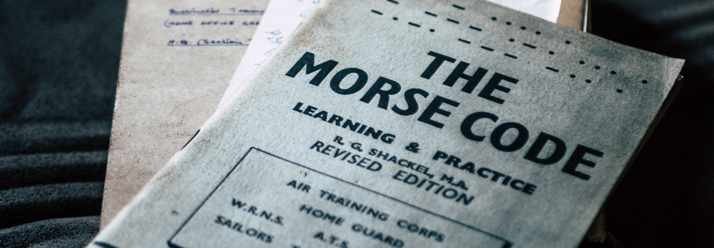

# **Расшифровка азбуки Морзе**  |  **Morse code decoder**

Алгоритмическая задача курса [**_"JavaScript/Front-end"_** Stage 0](https://rs.school/js-stage0/)

## Описание Задачи

Задача — написать функцию, которая декодирует азбуку Морзе и возвращает строку.
Реализованное решение в `src/index.js`

---

**Ввод:** Строка. Её длина кратна 10.
- Каждая буква алфавита закодирована точками (`.`) и тире (`-`). `10` означает точку (`.`), `11` означает тире (`-`).
- Каждая закодированная **длина буквы равна 10**.
- Если длина закодированной буквы **меньше 10**, она дополняется слева `0`.
- Пробел в строке — это `**********`.

**Вывод:** Строка (декодированная)

**Пример:** `me` -> `m === -- === 0000001111`, `e === . === 0000000010` -> `00000011110000000010`

---

## Тестирование решения
1. Установите [Node.js](https://nodejs.org/en/download/)
2. Сделайте форк этого репозитория
3. Склонируйте себе этот репозиторий: https://github.com/<%your_github_username%>/morse-decoder/
4. Перейдите в папку `morse-decoder`
5. Вбейте в командную строку `npm install` для установки зависимостей
6. Выполните `npm test` в командной строке.
7. Вы увидите число ожидающих (pending), проходящих и падающих тестов. 100% проходящие тесты соответствуют максимальному баллу за задание.